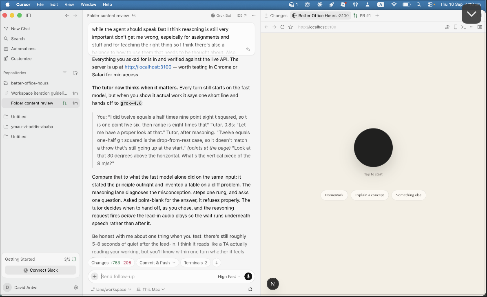
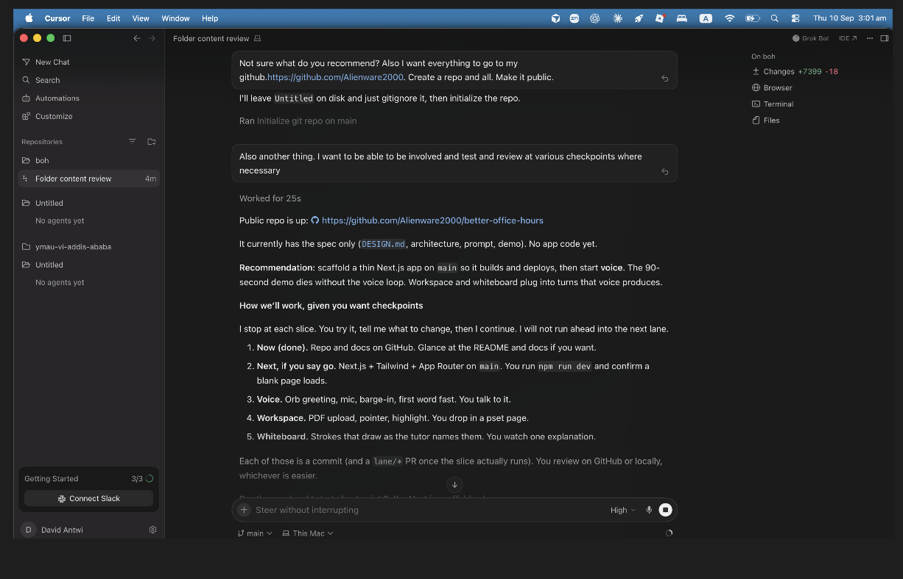
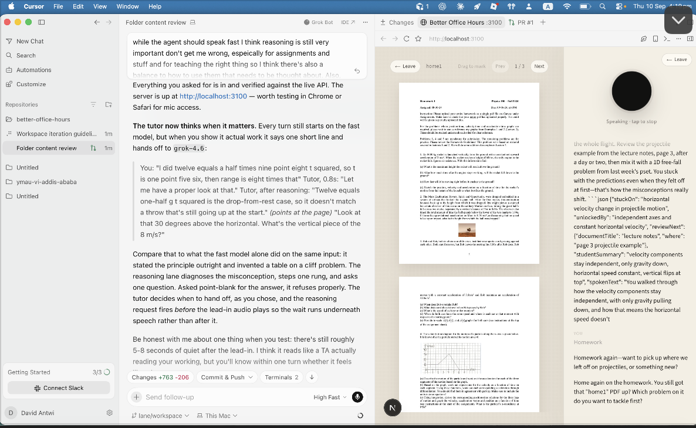
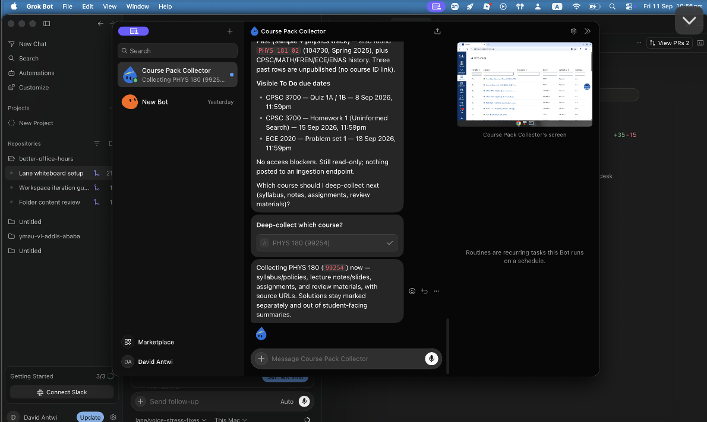

# Better Office Hours

A voice tutor that knows your course and talks you to the answer instead of handing it to you.

Built by David Antwi and Hussein Zindonda for the Yale AI Association x SpaceXAI hackathon.

## Demo

[Open Better Office Hours](https://better-office-hours.vercel.app).

The public demo video will be added after recording. The 90-second walkthrough is documented in [DEMO.md](docs/DEMO.md).

## The problem

Office hours are crowded, time-conflicting, and intimidating. Generic AI tutors do not know the student's course and often solve the problem instead of teaching the student how to solve it. In a 2025 field study, unguarded AI assistance improved practice performance but reduced later unassisted exam performance by 17 percent; a tutor with learning safeguards largely removed that harm ([Bastani et al., PNAS](https://doi.org/10.1073/pnas.2422633122)). Better Office Hours combines those safeguards with course context, voice, and a shared visual workspace.

## What it does

- Talks with the student through ElevenLabs speech recognition and synthesis.
- Sees uploaded problem sets and notes, including the student's marks.
- Points to and highlights the relevant part of a PDF.
- Draws and animates generated explanations on a shared SVG whiteboard.
- Guides graded work with short hints and questions instead of final answers.
- Supports homework, concept explanations, and other office-hours conversations in one desk.
- Saves separate conversations, board work, and transcript/JSON exports in the browser.
- Uses connected Canvas course excerpts through solution-safe retrieval.
- Closes substantive conversations with a student-first spoken recap and saved takeaway.
- Supports optional Yale Google identity when OAuth is configured.

## Helps students work toward their own answers

The tutor elicits the student's thinking first, advances one hint at a time, asks for predictions before explanations, and never bottoms out to the final answer on graded work. Posted solutions are excluded from student-facing retrieval. The tutor uses elicitation and contingent hints on graded work while explaining ungraded concepts directly. These safeguards are tested behaviors, not a guarantee that every generated response is correct. See [PEDAGOGY.md](docs/PEDAGOGY.md) for the learning basis and [PROMPT.md](docs/PROMPT.md) for the human-maintained tutor policy.

## Built in Cursor

The team built and coordinated this project in Cursor across separate voice, workspace, whiteboard, context, recap, and shell lanes.



Developing and running Better Office Hours in Cursor.

<details>
<summary>More screenshots from the build</summary>



Setting up the public repository and coordinating the build in Cursor.



An earlier development session testing the PDF workspace and tutor responses.

</details>

## Grok Bot course context

Course Pack Collector uses Grok Bot to gather a student's Canvas course profile, syllabus, lecture material, assignments, and posted solutions after the student approves Yale Duo. Student-visible retrieval must exclude solution text. The app supplies a scoped two-hour connection task, and accepts profile and extracted page-text uploads. See [grokbot/TASK.md](grokbot/TASK.md). The bot is signed into Canvas and collecting the selected archived PHYS 180 course. The actual course profile and first syllabus, Class 1 lecture notes and Homework 1 uploads were verified in the deployed app. The reusable bot share link is still pending.



Course Pack Collector during the read-only Canvas collection run. This screenshot shows the collection stage; the resulting source uploads were subsequently verified in the deployed app.

<!-- Add the reusable Grok Bot share link and collection GIF when available. -->

## Stack

- Next.js App Router, TypeScript, Tailwind CSS, and Motion
- PDF.js with custom pointer, highlight, and student-ink overlays
- Custom SVG whiteboard with generated declarative animations
- ElevenLabs STT and TTS with local Silero voice activity detection
- Grok through the OpenAI-compatible xAI API
- NextAuth with Google OAuth for Yale sign-in
- Private Vercel Blob storage for collected source text and PDFs; optional Supabase adapter
- Lexical retrieval with source/page attribution; embeddings remain future work

## Try it

Open [the hosted app](https://better-office-hours.vercel.app), allow the microphone, and tap the orb. No Google account is required for the guest concept tutor. Choose Explain a concept, then speak the topic. Pause stops voice; Sessions restores locally saved conversations.

The public deployment supports guest tutoring, private PDF uploads, and scoped course storage without Google sign-in. PDF rendering and annotation recovery were verified in a fresh browser. The first real Canvas collection was verified; course materials are not preloaded for unrelated visitors. The local rehearsal uses archived PHYS 180 material; the same desk is designed to work with other courses once their context is loaded. Deployment setup and checks are in [DEPLOYMENT.md](docs/DEPLOYMENT.md).

To run locally, install Node.js and configure xAI and ElevenLabs API keys:

```bash
git clone https://github.com/Alienware2000/better-office-hours.git
cd better-office-hours
npm ci
```

Copy `.env.example` to `.env.local` and preserve any existing local secrets:

```dotenv
XAI_API_KEY=your_key_here
ELEVENLABS_API_KEY=your_key_here
```

Course/PDF storage on Vercel uses a private Blob store linked to the project, which supplies `BLOB_READ_WRITE_TOKEN` (or `BLOB_STORE_ID` with OIDC). The deployed `boh-private` store is private. An optional Supabase alternative uses `NEXT_PUBLIC_SUPABASE_URL` and `SUPABASE_SERVICE_ROLE_KEY`. Set a random `INGEST_TOKEN` server secret to sign scoped collector connections. It is never handed to the bot directly. Local development can use `.data/private`.

Optional Google sign-in additionally requires `GOOGLE_CLIENT_ID`, `GOOGLE_CLIENT_SECRET`, and `NEXTAUTH_SECRET`. Without all three values, `/sign-in` reports that authentication is unavailable. Never commit `.env.local`.

```bash
npm run dev -- -p 3100
```

Open [localhost:3100](http://localhost:3100), allow microphone access, and activate the orb. API calls consume provider credits. Audio is processed by ElevenLabs, and conversation content plus supplied page and board images are sent to xAI.

## Current prototype limits

The tutor permits guests. Google identity is optional; a guest Canvas connection belongs to one browser and is not an authenticated app account. Transcript/board/recap saves remain browser-local, separated by authenticated identity when present. Course/PDF bytes persist in private Vercel storage. Cross-device session sync and cross-session learning memory are not implemented. The first actual Canvas collection is verified; human acoustic behavior still needs rehearsal. Generated diagrams can be imperfect and model reasoning latency remains noticeable.

## Development checks

```bash
npm run build
npx tsc --noEmit
node scripts/check-auth.mjs
node scripts/check-workspace.mjs
node scripts/check-anim.mjs --unit
```

Live model checks require a running development server and API credentials and can consume credits.

## Roadmap

Professor-configurable course guidance, lecture transcription, live screen sharing for coding courses, iPad handwriting, spaced review reminders, cross-course learning memory, and cross-device session sync.

## Team

- David Antwi: voice, workspace, and whiteboard
- Hussein: context, recap, authentication, and application shell

For current implementation status and contribution boundaries, read [STATUS.md](docs/STATUS.md), [DESIGN.md](docs/DESIGN.md), [ARCHITECTURE.md](docs/ARCHITECTURE.md), and [LANES.md](docs/LANES.md).
