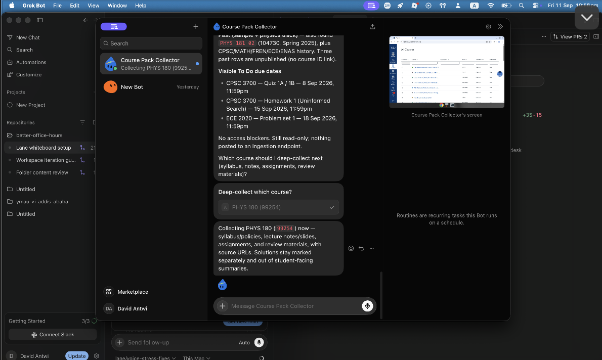
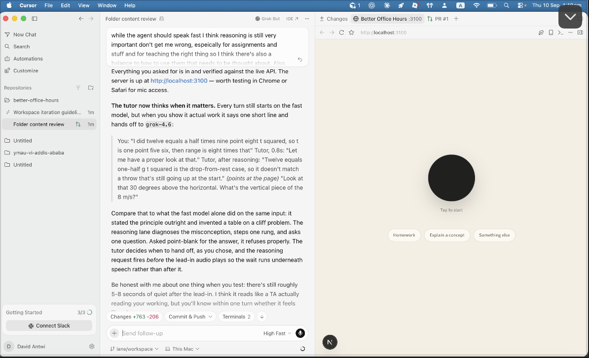
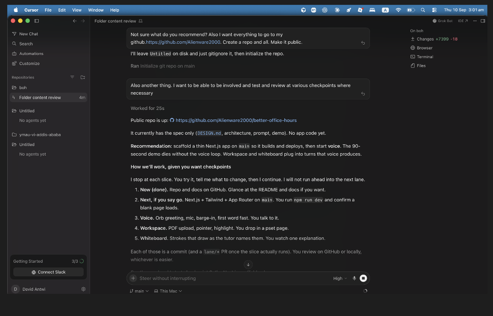
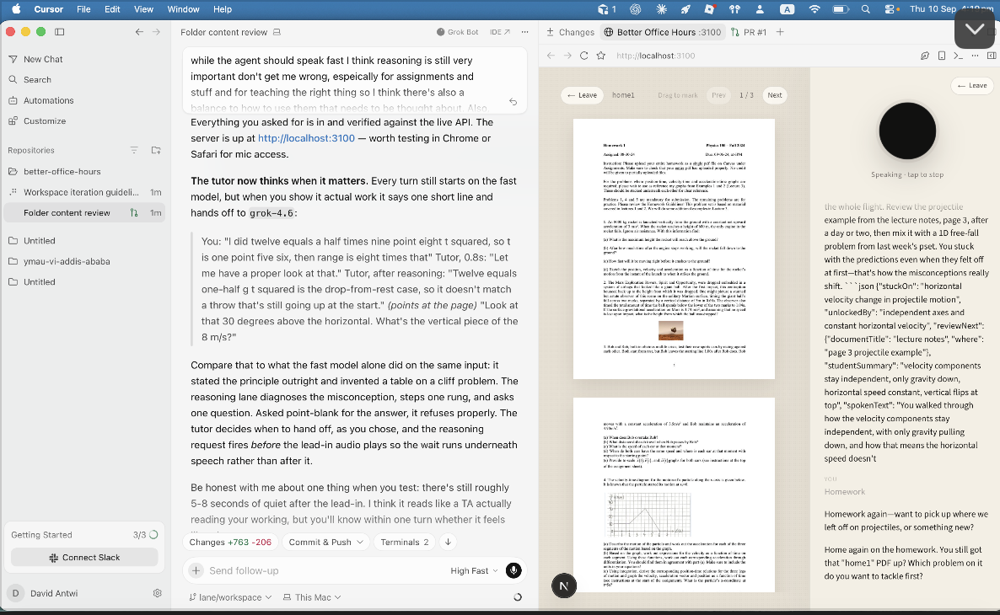

# Better Office Hours

A voice-first AI tutor with a shared whiteboard, annotated course materials, and short explanations that build understanding.

Created by David Antwi and Hussein Zindonda. Started at the Yale AI Association x SpaceXAI hackathon and continuing as an independent product.

Working on this project with a coding agent? Start with [the project memory walkthrough](docs/MEMORY_GUIDE.md). To reproduce the workflow elsewhere, use [the setup recipe](docs/MEMORY_RECIPE.md).

## Demo

[Hosted app](https://better-office-hours.vercel.app) (currently paused).

[LinkedIn post and demo video](https://www.linkedin.com/feed/update/urn:li:activity:7507274176781811712/).

## The problem

Office hours are crowded, time-conflicting, and intimidating. Generic AI tutors do not know the student's course and often solve the problem instead of teaching the student how to solve it. In a 2025 field study, unguarded AI assistance improved practice performance but reduced later unassisted exam performance by 17 percent; a tutor with learning safeguards largely removed that harm ([Bastani et al., PNAS](https://doi.org/10.1073/pnas.2422633122)). Better Office Hours combines those safeguards with course context, voice, and a shared visual workspace.

## What it does

- Talks with the student through ElevenLabs speech recognition and synthesis, with optional typed input and independent microphone mute.
- Sees uploaded problem sets and notes, including the student's marks.
- Points to and highlights the relevant part of a PDF.
- Draws and animates generated explanations on a shared SVG whiteboard.
- Guides graded work with short hints and questions instead of final answers.
- Supports homework, concept explanations, and other office-hours conversations in one desk.
- Saves separate conversations, board work, and transcript/JSON exports in the browser.
- Uses connected Canvas course excerpts through solution-safe retrieval.
- Closes substantive conversations with a student-first spoken recap and saved takeaway.
- Supports optional Yale Google identity when OAuth is configured.

## Helps students work toward their own answers

The tutor is instructed to elicit the student's thinking first, advance one hint at a time, and withhold final answers on graded work. Posted solutions are excluded from student-facing retrieval. The tutor uses elicitation and contingent hints on graded work while explaining ungraded concepts directly. Generated responses can still violate these instructions; live evaluation and disclosure safeguards remain ongoing work. See [PEDAGOGY.md](docs/PEDAGOGY.md) for the learning basis and [PROMPT.md](docs/PROMPT.md) for the human-maintained tutor policy.

## Grok Bot course context

Course Pack Collector uses Grok Bot to gather a student's Canvas course profile, syllabus, lecture material, assignments, and posted solutions after the student approves Yale Duo. Student-visible retrieval must exclude solution text. The app supplies a scoped two-hour connection task, and accepts profile and extracted page-text uploads. See [grokbot/TASK.md](grokbot/TASK.md). During the original demo, the archived PHYS 180 course profile, syllabus, Class 1 lecture notes and Homework 1 uploads were verified in the deployed app. The reusable bot share link is still pending.



Course Pack Collector during the read-only Canvas collection run. This screenshot shows the collection stage; the resulting source uploads were subsequently verified in the deployed app.

<!-- Add the reusable Grok Bot share link and collection GIF when available. -->

## Stack

- Next.js App Router, TypeScript, Tailwind CSS, and Motion
- PDF.js with custom pointer, highlight, and student-ink overlays
- Custom SVG whiteboard with MathJax, progressive writing, generated declarative animations, and editable student ink
- ElevenLabs STT and TTS with local Silero voice activity detection
- Claude Opus 5 through OpenRouter using the OpenAI SDK; explicit Grok rollback through xAI
- NextAuth with Google OAuth for Yale sign-in
- Private Vercel Blob storage for collected source text and PDFs; optional Supabase adapter
- Lexical retrieval with source/page attribution; embeddings remain future work

## Try it

The [hosted app](https://better-office-hours.vercel.app) is paused while development continues. The [demo video](https://www.linkedin.com/feed/update/urn:li:activity:7507274176781811712/) shows the original experience. Use the local app to try the current implementation.

Tap the orb to talk, or open Type a message. Bring a topic, upload a PDF, or optionally connect Canvas. The tutor explains with generated board visuals and PDF cues. Write on the shared desk, ask a follow-up, and resume saved conversations through Sessions. Course materials are scoped to your connection and are not preloaded for unrelated visitors.

To run locally, install Node.js and configure OpenRouter and ElevenLabs API keys:

```bash
git clone https://github.com/Alienware2000/better-office-hours.git
cd better-office-hours
npm ci
```

Copy `.env.example` to `.env.local` and preserve any existing local secrets:

```dotenv
BOH_TUTOR_PROVIDER=opus
OPENROUTER_API_KEY=your_key_here
ELEVENLABS_API_KEY=your_key_here
```

Course/PDF storage on Vercel uses a private Blob store linked to the project, which supplies `BLOB_READ_WRITE_TOKEN` (or `BLOB_STORE_ID` with OIDC). The deployed `boh-private` store is private. An optional Supabase alternative uses `NEXT_PUBLIC_SUPABASE_URL` and `SUPABASE_SERVICE_ROLE_KEY`. Set a random `INGEST_TOKEN` server secret to sign scoped collector connections. It is never handed to the bot directly. Local development can use `.data/private`.

Optional Google sign-in additionally requires `GOOGLE_CLIENT_ID`, `GOOGLE_CLIENT_SECRET`, and `NEXTAUTH_SECRET`. Without all three values, `/sign-in` reports that authentication is unavailable. Never commit `.env.local`.

```bash
npm run dev:local
```

Open [localhost:3105](http://localhost:3105). This launcher uses checkout-local storage and disables cloud storage and Google sign-in. API calls consume provider credits. Audio is processed by ElevenLabs. Conversation content and supplied page/board images go through OpenRouter to the selected model provider.

Opus is the default for routing, teaching, visual repair, and recap. To roll back deliberately, set `BOH_TUTOR_PROVIDER=grok` and configure `XAI_API_KEY`; tutor content then goes to xAI. A missing key does not silently switch providers. Restart your local server after changing configuration. The separate Grok Bot Canvas collector is unchanged.

## Current prototype limits

The tutor permits guests. Google identity is optional; a guest Canvas connection belongs to one browser and is not an authenticated app account. Transcript/board/recap saves remain browser-local, separated by authenticated identity when present. Course/PDF bytes persist in private Vercel storage. Cross-device session sync and cross-session learning memory are not implemented. Human acoustic behavior still needs rehearsal. The STEM design gallery is an authored prototype, separate from model-generated tutoring. Generated diagrams can be imperfect and model reasoning latency remains noticeable.

## Development checks

```bash
npm run build
npx next typegen
npx tsc --noEmit
npm run lint
node scripts/check-candidate.mjs
node scripts/check-auth.mjs
node scripts/check-workspace.mjs
node scripts/check-anim.mjs --unit
```

Live model checks require a running development server and API credentials and can consume credits.

## Roadmap

Professor-configurable course guidance, lecture transcription, live screen sharing for coding courses, iPad handwriting, spaced review reminders, cross-course learning memory, and cross-device session sync.

## Built in Cursor

The team built and coordinated this project in Cursor across separate voice, workspace, whiteboard, context, recap, and shell lanes.



Developing and running Better Office Hours in Cursor.

<details>
<summary>More screenshots from the build</summary>



Setting up the public repository and coordinating the build in Cursor.



An earlier development session testing the PDF workspace and tutor responses.

</details>

## Team

- David Antwi: voice, workspace, and whiteboard
- Hussein: context, recap, authentication, and application shell

For current implementation status and contribution boundaries, read [STATUS.md](docs/STATUS.md), [DESIGN.md](docs/DESIGN.md), [ARCHITECTURE.md](docs/ARCHITECTURE.md), and [LANES.md](docs/LANES.md).
