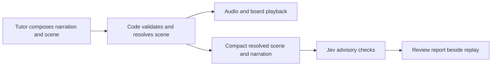

# Jev and Better Office Hours

Research date: September 20, 2026. Repository baseline: `2581302`. Requested by David after seeing Jev discussed on X. This is a source review and architecture assessment, not a Jev benchmark or implementation. No credentials, student transcripts, PDFs, or board images were sent to Jev. No dependency was installed, no paid inference was run, and no runtime or Vercel state changed. The public project remains paused.

## Recommendation

Jev is worth evaluating as an inexpensive semantic checker alongside the tutor. It is not a drawing engine or a replacement for the model that writes explanations and composes scenes. First test whether it reliably catches narration/scene disagreements and unclear explanations outside the live playback path. Consider routing only after measuring the current router and matching its behavior. Do not insert an untested judge in front of every spoken beat.

The immediate `stale_drawing` interruption still needs a code/state investigation. Another probabilistic model is not the right repair for an exact missing-ID check. This research does not replace that work.

## Deferred follow-up

September 20: David explicitly deferred Jev integration until speech completion, latency, and board reliability are stable. He added that browser/computer-use examples motivated the interest. Later inspect specific examples and separate Jev's decisions from the surrounding browser agent's perception and actions. Explore an advisory browser QA workflow using measured board state and narration; do not assume Jev itself reads screenshots or controls the browser. No examples were supplied or newly verified in this follow-up.

## What it actually is

Jev is TypeSafe's first public System One model, announced September 15. TypeSafe describes a parallel sampler and reinforcement learning for calibrated decisions (RLCD). Those are vendor descriptions, not architecture independently reproduced in this research. [Launch announcement](https://typesafe.ai/blog/introducing-system-one-models-and-jev).

The interface accepts state plus predefined questions. Choice selects a supplied option; Score rates against ordered criteria; Noul estimates the probability of yes. Questions in one request are evaluated independently against the same state. If one answer changes another question, compose that dependency in code or make a subsequent request. [Primitives](https://docs.typesafe.ai/primitives).

It currently reads text/JSON, not images, audio, or video. It does not generate prose, SVG, LaTeX, code, or reasoning explanations. Thus a demo controlling a visual game is not evidence that Jev can see or draw images. [System One capabilities](https://docs.typesafe.ai/concepts/system-one). The launch's Doom demonstration explicitly used structured game state. [Demo caveat](https://typesafe.ai/blog/introducing-system-one-models-and-jev#fun-demos).

A useful BOH example: provide an accepted scene description and proposed narration, then ask whether the narration claims a visible feature absent from that description. This evaluates a representation of the board. It does not verify the actual pixels, font loading, viewport clipping, or playback timing.

## Fit for our specific problems

These are proposed applications inferred from the documented interface, not demonstrated Jev capabilities on BOH.

| BOH need | Potential Jev role | What still owns the result |
| --- | --- | --- |
| Narration says rainbow but only one colored line exists | Flag a semantic mismatch from explicit color roles and scene facts | Renderer facts, literal-color rules, and human visual review |
| Explanations feel compressed or textbook-like | Separate checks for unexplained terms, missing causal links, and unanswered questions | Tutor model rewrites; student feedback judges usefulness |
| Picking what to emphasize next | Choose among existing named objects or a small set of presentation actions | Code validates current page, revision, allowed IDs, and permissions |
| Choosing diagram versus graph or animation | Advisory representation choice with uncertainty/other options | Generative model composes an original, topic-appropriate scene |
| Label collisions and clipping | Little value over direct measurement | Layout code uses measured glyph/shape bounds and protected student ink |
| Color theory and visual hierarchy | May assess semantic roles such as emphasis versus reference | Authored design tokens, quantity identity, contrast calculations, literal-color exceptions |
| Equations, correct vector components, scientific motion | No role as the numerical authority | Reasoning model and exact math/geometry validation |
| Cinematic reveal and speech timing | May choose among suitable high-level actions | Timeline, TTS alignment, animation interpolation, interruption handling |
| Stale drawing IDs and partial responses | Optional review of recurring patterns | Deterministic validation, scene-state synchronization, and audio lifecycle |
| Routing logistics versus substantive help | Plausible closed-choice classifier | Existing fallback, course selection, recap state, and response generation |

We should not replace rich diagrams with a catalogue of fixed topic scenes just because a classifier chooses well. Our composable objects and general scene specifications remain. Jev could select an action such as focus, annotate, compare, or transform among allowed candidates; it cannot invent the contents of that action.

## Important limitations behind the excitement

TypeSafe's own limitation page warns about counting, numerical precision, comparing hex/RGB colors, indirect reasoning, unrelated context, adversarial input, and inconsistent answers across differently phrased questions. It explicitly advises against forcing text generation through chains of choices. These are particularly relevant to coordinates, physics, color distances, and drawing correctness. [Jev 1.13 limitations](https://docs.typesafe.ai/model-jaggedness/jev-1.13).

Confidence is a statistic derived from a Choice or Score distribution, not an individually guaranteed probability of correctness. Noul has no separate confidence field. Tune thresholds for the actual question and model version; a confident misclassification remains possible. [Confidence documentation](https://docs.typesafe.ai/confidence). A schema-valid selection can still be the wrong selection, so marketing about zero hallucinations must not become a promise of correct teaching.

A particularly relevant public example is [Clarity Judge](https://github.com/TypeSafeAI/clarity-judge). Its README describes separate writing checks and candidate-sentence evidence selection. Despite the organization name, the README identifies it as an independent community project. Its no-key public demo uses simulated results. It is a useful interface precedent, not measured proof of explanation quality. I did not run it or send it a key.

## Speed evidence, separated from our latency

TypeSafe advertises 70–500 ms end-to-end calls and very large workflow speedups. The launch notes that tests generally ran from US West Coast laptops, the short demo state is favorable, and headline workflow gains are at the high end. These figures cannot be applied to producing a full tutor response. [Vendor evidence and caveats](https://typesafe.ai/blog/introducing-system-one-models-and-jev).

The vendor's four workflow evaluations cover security incidents, support-agent traces, invoices, and customer service. Their reference labels come from high-reasoning Astra/Fable consensus, with other configurations at provider-default reasoning. This measures agreement under a chosen harness, not student comprehension, scientific correctness, board quality, or our current low-effort trial. [Evaluation methodology](https://evals.typesafe.ai/).

An independent repository reports a synthetic review-classification comparison: Jev median 647 ms and p95 910 ms versus Luna median 1,556 ms and p95 2,084 ms. One Jev attempt failed after 41.03 seconds. It used 100 reviews repeated three times, not 300 independent reviews, and labels had acknowledged ambiguity. I inspected the published result, not reran it. Useful evidence for potentially faster classification, not a tutoring ranking. [Original benchmark](https://github.com/mameli/jev-vs-luna).

For BOH, the relevant accounting is the critical path through endpointing, transcription, routing, first accepted teaching beat, synthesis, and actual playback. Replacing a router saves only time spent on routing, less any new conversion/fallback work. Adding Jev after a generated beat adds delay if speech waits for it. Running a checker alongside playback initially improves observability, not the already-spoken output. Neither arrangement makes the generative tutor's own work disappear.

## Access and cost

At review time, direct TypeSafe lists `jev-1.13.0` at $0.042 per million input tokens, output free. The combined request limit is 64k, with state plus the longest individual question limited to 32k. Published rate limits are explicitly dynamic. Pin a version for evaluation rather than a moving latest alias. [Model reference](https://docs.typesafe.ai/models).

OpenRouter lists `typesafe/jev-1.13` at the same token price and a 32k context limit. This makes our existing provider path a plausible experiment, but it is not a drop-in model-name change to our chat-completions call. [OpenRouter model listing](https://openrouter.ai/typesafe/jev-1.13/). Its published example uses `openRouter.alpha.decisions.create` with state/questions. Labs are experimental, so verify request shape and availability when implementing. [Decision example](https://openrouter.ai/labs/jev/compile), [Labs status](https://openrouter.ai/labs).

Illustrative arithmetic, not a bill: a request with 5,000 total billed input tokens would cost $0.00021 at that rate; 10,000 such calls would cost $2.10. Include question/rubric tokens and all requests, not just the student's sentence. This excludes generation, audio, retries, and any gateway fees. Low token price does not establish reliability or latency.

Vercel's AI Gateway exposes an evaluation API; Cloudflare also documents typed questions. These are access alternatives, not reasons to migrate BOH or resume its paused deployment. [Vercel interface](https://vercel.com/ai-gateway/models/jev), [Cloudflare interface](https://developers.cloudflare.com/ai/models/typesafe/jev/).

TypeSafe says it does not train on customer requests; enterprise zero-data-retention is a separate offering. Do not equate no training with no retention. Gateway handling also matters. Any initial experiment should use synthetic examples; real student material needs an explicit data-handling decision. [Model data policy](https://docs.typesafe.ai/models#data-handling), [Legal overview](https://docs.typesafe.ai/legal).

## Where this meets our code

The following source paths were inspected, not modified:

- [concept-routing.ts](../lib/agent/concept-routing.ts) returns kind, speech, and courseId. Jev could select a route/course candidate, but cannot generate the existing logistics/definition speech. A replacement must preserve that behavior or explicitly redesign it.
- [grok.ts](../lib/agent/grok.ts) sends separate routing and teaching contexts and uses streamed chat completions. A decision adapter belongs outside that generation contract. It should receive compact named state, not blindly reuse multimodal messages or the whole history.
- [concept-response.ts](../lib/agent/concept-response.ts) checks highlights against current drawing IDs. Topic/page transitions can invalidate them. The observed stale_drawing error is an exact referential constraint; Jev must not override it.
- [concept-stream.ts](../lib/agent/concept-stream.ts) preserves accepted output and bounds recovery. An advisory judge must not introduce repeated speech or unbounded repair loops.
- [diagram-layout.ts](../lib/whiteboard/diagram-layout.ts) already measures annotation placement costs. Improving these deterministic constraints addresses overlap directly.

The existing [whiteboard design research](WHITEBOARD_RESEARCH.md) remains the architectural direction: scene meaning, reusable visual rules, measured layout, and narrated events. Jev is an optional checker around that system.

Initial experiment: E cannot block C, change a scene, loosen a graded-work boundary, or mark student mastery. Later pre-playback use needs separate evidence and an explicit latency budget.

## A bounded evaluation proposal

1. Create a synthetic case bank across physics, biology, astronomy, and everyday explanations. Include good examples and deliberately planted mismatches, jargon, stale references, irrelevant visuals, and ambiguous cases. Keep every bad case paired with a minimally changed good case. Split by scenario before tuning so paraphrases do not leak into the held-out set.
2. Compute exact facts in code: present IDs, visibility/revision, measured overlaps, color names/roles, equation labels, and animation state. Distinguish a proposed scene from what actually appeared. Jev receives only the relevant facts and narration.
3. Ask a few independent questions: does the speech refer to an absent feature; is a required term unexplained; does the explanation omit the stated causal link? Include insufficient-information outcomes where appropriate. These are candidate rubrics requiring human review, not established measures of learning.
4. Compare with simple rules and the existing model on identical inputs. Have David judge board/narration usefulness independently. A model-written label alone is not ground truth. Report false alarms, missed defects, abstentions, performance on each subject, and probability calibration where sample size permits.
5. Measure request p50/p95, timeout rate, all-attempt cost, and any first-useful-audio change separately. Count failures and retries. A pilot of roughly 100 cases can expose defects but cannot establish rare-error safety. Use a held-out evaluation and enough samples per consequential category before enabling automatic actions.
6. Display the scene, speech, each check, model version, timing, and human verdict together in the existing local review tooling. Start with replay evaluation. If useful, add asynchronous advisory checks with strict timeouts and no effect on playback; the checker being unavailable must not stop a lesson.

Adopt only if it catches meaningful errors beyond code at an acceptable false-alarm rate and retains the quality floor. Reject or narrow its role if results depend on lengthy vision-to-text preprocessing, if a new serial call worsens first audio, or if confident mistakes persist. No numeric adoption threshold has been selected or validated yet.

## Research boundary

Reviewed first-party documentation, the launch and vendor methodology, actual integration examples, project-authored community READMEs, and relevant BOH code. Discovery directories and social posts were used to find sources, not as technical authority. I found no evaluated BOH-like whiteboard result in the reviewed sources. This is not a claim that none exists anywhere. Jev performance, calibration, and availability for our deployment region remain unmeasured. Groundtrack tools were unavailable, so this local report is the durable record.
