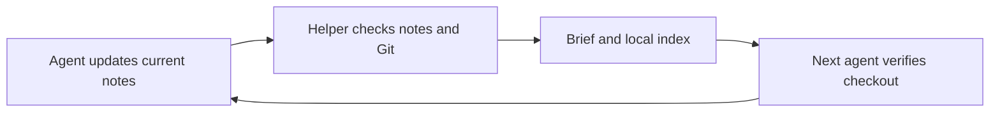

# Your guide to project memory

This is the human walkthrough. You can keep working conversationally: the agent should maintain the files and run the commands. For detailed operating instructions see [WORKFLOW](WORKFLOW.md). To reproduce the pattern in another project, use [the setup recipe](MEMORY_RECIPE.md).

## The two things you say

When starting another chat or using another coding agent:

> Reorient this checkout and continue from the relevant handoff. Read AGENTS.md and run npm run context. If that command is missing, use ~/.local/bin/boh-context. Verify the available code before continuing.

Before leaving a chat:

> Checkpoint where we are for the next agent. Update the task, project status, and useful lessons; record unfinished work and checks; commit the intended changes locally if appropriate; then run npm run handoff.

The first prompt works with our installed helper on this machine. On a different machine, bring the code and checkpoint over and install the helper there first. For a client without terminal access, provide the generated brief and AGENTS.md; it still needs repository access to change code.

You do not need a new worktree for a new chat. Keep the same project folder for ordinary sequential work. A separate checkout is useful when work needs an independent set of files, for example a test that should not disturb your running tutor.

## What the npm commands actually mean

`npm run` asks npm to execute a named shortcut in package.json. We created these shortcut names in this project; they are not special AI features or commands every project already has.

Our [package.json](../package.json) contains these entries:

```json
{
  "context": "node scripts/context.mjs",
  "context:check": "node scripts/context.mjs --check",
  "handoff": "node scripts/context.mjs --write"
}
```

`node` runs the JavaScript file. The flags select different behaviors in the same [helper](../scripts/context.mjs).

| You or the agent runs | What happens |
| --- | --- |
| `npm run context` | Reads Git and memory files, then prints a brief. Changes no files. |
| `npm run context:check` | Checks required task fields, branch/base consistency, document links, client bridges, and size limits. Reports problems; does not repair them. |
| `npm run handoff` | Validates, writes a continuation brief, and updates this checkout's local index entry. |
| `npm run context -- --full` | Prints the larger reference packet when more detail is needed. |
| `npm run context -- --install` | Installs or refreshes the helper outside the checkout, then saves a handoff. Usually setup/maintenance only. |

The extra `--` tells npm to pass the following flag to our script. These memory commands need Git and Node, but no AI API call, subscription, or installed project dependencies. Starting the tutor with `npm run dev:local` is a separate operation; real tutor conversations use the configured providers.

## What gets remembered, and where

Think of the project folder as a notebook that stays available after a conversation ends. The next agent reads a short current page, then opens supporting pages when needed.

| Location | What it answers | Who maintains it |
| --- | --- | --- |
| AGENTS.md | What rules must every agent follow? | Agent/human when rules change |
| docs/STATUS.md | What works in the project, and what is currently constrained? | Agent as project state changes |
| docs/TASK.md | What are we doing now, what happened, and what comes next? | Agent during meaningful progress and before stopping |
| docs/NOTES.md | What lesson could prevent a repeated mistake? | Agent when a useful lesson emerges |
| docs/archive/ | What happened in completed tasks? | Agent archives before replacing a completed task |
| .data/handoff/CONTINUE.md | What brief can I give the next agent? | Generated by the helper |
| ~/.local/share/boh-context/repos/ | Which local checkout has a saved task checkpoint? | Updated by handoff/install |

The Markdown source files are tracked with the code. The generated brief and machine-local index are outside Git tracking. Each index record holds one latest task snapshot for a checkout, its location, branch, commit, and whether uncommitted changes existed. It is small bookkeeping, not a backup of the project.



The agent does the thinking and writing. The helper assembles those notes and checks mechanical consistency. It cannot tell whether a written conclusion is true, silently remember everything said, or reconstruct an unrecorded decision. An abrupt shutdown preserves the last written notes, not necessarily the last conversation. That is why agents are instructed to checkpoint at meaningful milestones, not only at the end.

## A concrete example

Suppose we are fixing a diagram that does not move when the tutor describes motion. Before pausing, the agent might record:

> Objective: make the diagram follow the intended motion. Progress: reproduced the stationary object. Finding: its generated movement progress stays at 1. Next: replay the saved spec and decide whether generation or rendering should change. Validation: reproduction only; no fix verified yet.

That is an illustrative checkpoint, not a new claim that we tested a fix. It records the reasoning needed to resume without carrying every sentence of the conversation. The next agent inspects the relevant evidence and code, then continues the unfinished step.

When that task is completed, its page moves to a dated archive. TASK becomes the next task. A lasting lesson can remain as a few lines in NOTES with a pointer to the detailed record.

## How different checkouts fit together

A checkout is a folder containing a version of the code. A branch names a line of development. A commit is a saved Git revision. Uncommitted, or "dirty," work means files differ from that revision. Git worktrees share a repository's Git history; separate clones have their own Git histories.

In the same folder, a new chat reads the same notes. In another worktree, Git tells the helper where sibling folders are. For separate clones, an agent must first run handoff in each compatible clone so the local index knows their locations. There is no search of every folder on the computer.

The helper compares repository identities and available commits. It may report that the current checkout is behind, that histories diverged, or that a source commit is unavailable here. It also flags uncommitted work. The agent uses that information to determine where the intended task lives; the helper does not pick the newest timestamp and switch branches for you.

For example, checkout A may contain our latest fix while B contains the submitted version. A checkpoint can tell an agent in B about the fix, but it does not put the fix's code in B. The agent must work in A or deliberately transfer the relevant code within your authorization.

The installed `~/.local/bin/boh-context` entry point works even in an old checkout that lacks our npm scripts. Its implementation lives outside those checkouts, so deleting its original source folder does not remove the helper. Deleting a checkout can still destroy uncommitted code or local data. A remembered task description does not recover those files; cleanup remains a separate, deliberate action.

## How this stays small

TASK describes one current task, rather than accumulating all past tasks. Completed pages remain searchable in the archive. Default orientation includes authority, the current task, and checkout information; detailed references are loaded when needed. This guide and the reproduction recipe are also reference documents, not part of the default packet.

Current limits are 6,000 characters for TASK, 12,000 for the default brief, and 28,000 for the optional full packet. These are character limits, not exact model token counts. Checks refuse an oversized checkpoint; the agent must compact or archive it. The system does not perform automatic AI summarization or enlarge any model's context window. Standing instructions and other files an agent opens also consume context beyond the brief.

## What is automatic, and what still needs care

After an agent runs the command, reading Git metadata, discovering sibling worktrees, validating structure, and assembling the brief are automatic. Choosing useful memories, keeping notes accurate, and deciding which task to resume remain agent responsibilities. Client instruction files point agents at the shared rules, but a completely new client may need the startup prompt above.

Changing coding models works because the memory is ordinary text and Git metadata. Each client still needs its own login, tools, and repository access. There is no always-running service or synchronization between computers. The files are only as current as the last checkpoint.

Groundtrack is an optional additional layer for searching engineering experiences. It is configured here but not yet verified with a live authenticated event. This file-based workflow already works without it. Neither system is the tutor's memory of students.

## If something looks wrong

| Situation | What to ask the agent to do |
| --- | --- |
| The npm command is missing | Use the installed helper from this checkout, or transfer/install it on a new machine. |
| The brief shows a different branch or unfinished work | Inspect actual files and the relevant source checkpoint before continuing. |
| The notes are too long | Archive completed detail, retain current constraints, and rerun the check. |
| A checkout disappeared | Inspect the saved task snapshot, then locate the actual code or backup. |
| A chat ended unexpectedly | Resume from the last saved checkpoint and reconcile it with Git changes. |

To set this up again elsewhere, give the next agent [MEMORY_RECIPE.md](MEMORY_RECIPE.md) and the referenced helper source. It includes a copyable setup request, starter templates, and acceptance checks.
