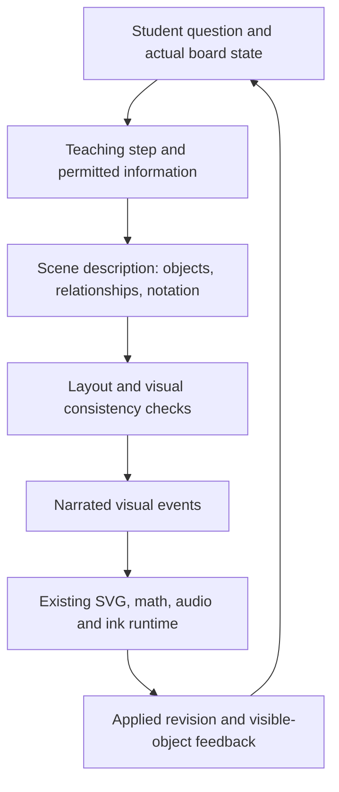

# A more intentional teaching board

Research and design proposal, September 16, 2026. Repository baseline: `f3b85ed`. Requested by David after comparing the current trial with earlier Grok diagrams. This document proposes a direction; no renderer replacement, model migration, or runtime change was made.

David's follow-up on cinema, explainer videos, notes, and retention is covered in [Drawing, cinema, and remembering an explanation](WHITEBOARD_LEARNING_RESEARCH.md), with original studies, limitations, and a proposed learning evaluation.

## Recommendation in plain language

Keep the paper board, student ink, equations, and fast conversational loop. Build a stronger connection between what the tutor wants to explain and what the board displays.

The model should describe an explanation through meaningful objects and relationships: this arrow belongs to this object; this equation term names that arrow; this motion demonstrates this change. The application should handle consistent appearance, legible placement, continuity, and playback. The tutor remains responsible for choosing a scientifically appropriate representation and explaining it well. A layout engine cannot make an incorrect explanation true.

The next step should be a small, isolated visual prototype with replay and comparison. A complete rewrite would put working voice, ink, recovery, and interruption behavior at risk before we establish what improves the experience.

## What David is asking for

The earlier screenshots establish a useful visual reference: restrained color, pale reference paths, strong object outlines, attached component vectors, well-spaced annotations, typeset equations, and a coherent physical setting. David describes the animations as deliberate and cinematic. Static screenshots establish composition, but cannot establish playback quality, scientific correctness, or a model ranking.

This is broader than revealing strokes in order. It includes choosing the right representation, giving the eye a clear focus, connecting symbols to the picture, and making motion explain something. Richness means useful visual information. Simple objects can support rich explanations; forcing every explanation into boxes cannot.

The requirements remain: simple but complete reasoning, quick first useful audible response, relevant board involvement on every spoken turn, meaningful color, equations when requested and appropriate, interruption, scene continuity, and preserved student authorship. Concept examples may explain directly. Graded answers and unknown prediction outcomes must remain withheld at the appropriate step.

## Relevant systems and what to take from them

These are public-source findings, with adoption judgments specific to BOH. Product descriptions and repository claims are not independently verified performance results. No commercial tutor was signed into or acoustically tested, no external project was installed, and no private sessions were uploaded.

| Reference | What the source establishes | Application to BOH and limits |
| --- | --- | --- |
| [Penrose](https://penrose.cs.cmu.edu/docs/ref) | Separates a diagram's domain, named objects/relationships, and visual style; compiles those descriptions into an optimization problem. | Strong architectural precedent for moving reusable visual rules into software. Start with our existing constraints and measured layout. Importing a full solver needs a separate performance and integration experiment. |
| [Bloom](https://penrose.cs.cmu.edu/docs/bloom/tutorial/optimization) | Penrose's JavaScript interface builds diagrams from inputs and constraints; inputs can be pinned rather than optimized. | Useful for keeping an established scene stable while adjusting labels or adding relationships. Do not re-optimize an entire page during speech. Solver success does not establish teaching quality. |
| [Manim Voiceover](https://voiceover.manim.community/en/stable/quickstart.html) | Groups animation with narration and supports word bookmarks to trigger visual actions. | Borrow the idea of meaningful narrated events and reusable transitions. Keep Manim outside the live loop, as DESIGN requires. Its authored-video workflow is not our interruptible browser session. |
| [PhET implicit scaffolding research](https://arxiv.org/abs/1306.6544) | Describes how affordances, constraints, cues, and feedback can guide exploration, illustrated with simulation interviews. | Use clear starting states, relevant cues, and purposeful changes. PhET's designed simulations do not prove that arbitrary model-generated scenes will teach well. |
| [Mafs](https://mafs.dev/guides/get-started/hello-f-x) | Provides declarative React mathematics components, plots, coordinate systems, and constrained movable points. | Useful reference for a reusable mathematical vocabulary and explicit coordinate frames. A possible plotting experiment later, rather than an immediate second board engine. Its docs mark animation and LaTeX sections experimental. |
| [tldraw agent starter kit](https://tldraw.dev/starter-kits/agent) | Combines screenshots, simplified shape data, viewport context, lints, validated actions, and streamed updates for a canvas agent. | Borrow compact scene context and actionable validation feedback. BOH already sends images and structured ownership. Migrating the whole editor would require preserving its voice, math, ink, and replay contracts. |
| [Bret Victor's dynamic drawing notes](https://worrydream.com/DrawingDynamicVisualizationsTalkAddendum/) | Explains explicit geometric intent, parameterized relationships, and reusable sub-pictures. | A useful principle for maintaining attachments during change. The runtime should enforce declared relationships instead of guessing physics from labels. This is a design prototype reference, not a drop-in library. |
| [HeyPapin](https://www.heypapin.com/) | Its product page describes spoken explanations on a shared editable board, interruptions answered on existing objects, and saved boards. | A close interaction precedent to study in a future hands-on comparison. The page does not establish its latency, instructional effectiveness, or robustness across subjects. |
| [Khayyam Math](https://github.com/khayyam-math/khayyam-math) | Its repository describes generated SVG figures with phrase-timed narration, structured figure routes, and mathematical verification. | Relevant separation of content, rendering, and checks. Its topic/template routing is unsuitable for our no-canned-scenes boundary. Its correctness and speed claims were not reproduced; we should not inherit them. |
| [BoilerSketch, 2026 preprint](https://arxiv.org/abs/2608.00844) | Describes supervised CS tutoring with structured Mermaid output and a pen-enabled board. Reports a 45-minute evaluation with 21 instructional staff. | Evidence that constrained output can make a narrow class of diagrams useful. This is staff feedback, not a student learning trial; Mermaid cannot replace spatial, mathematical, and animated representations across our subjects. |

There are therefore close products and mature pieces of the problem. None of the reviewed evidence establishes a ready-made replacement that satisfies all our requirements.

For possible future dependency decisions: tldraw's SDK is source-available and its production use requires an appropriate license; examples may use different terms. PhET's current regular HTML simulation license is noncommercial, and PhET-iO is separately licensed. We are borrowing design ideas in this proposal, not bundling either product. See the official [tldraw license](https://tldraw.dev/community/license) and [PhET licensing](https://phet.colorado.edu/en/licensing) pages.

## What learning research changes about the design

Mayer and Moreno's *Nine Ways to Reduce Cognitive Load in Multimedia Learning* supports signaling the relevant part, placing labels near their referents, coordinating relevant words and pictures, removing extraneous material, and segmenting demanding explanations. It does not prescribe a universal word count or prove that shorter explanations are better. The reviewed segmentation example also gave learners more study time; that limits a simplistic interpretation of the result. These are useful design hypotheses for our voice tutor, not measured BOH learning gains. [Paper, 2003](https://carpentries.github.io/instructor-training/files/papers/mayer-reduce-cognitive-load-2003.pdf).

Tversky, Morrison, and Betrancourt caution that attractive animation can be too fast or complicated to understand. Its structure should match the concept, and important changes must be perceptible. [Animation: Can It Facilitate?, 2002](https://www.tc.columbia.edu/faculty/bt2158/faculty-profile/files/_Morrison_Betrancourt_AnimationCanitfacilitate.pdf).

Our design interpretation: distinguish writing, attention, and explanatory motion. Writing helps the learner follow construction. Attention highlights a relevant object. Explanatory motion shows a changing relationship. Give each a purpose, and preserve a legible resting state. Let the learner interrupt and revisit it. Keep captions available for accessibility; reducing duplicated prose on the drawing does not justify removing captions.

## What we already have, and where it falls short

This audit inspected source at the baseline above. It did not change or retest the live trial. Earlier runtime evidence is in the [scene review](evaluations/2026-09-16-scene-direction.md).

| Existing mechanism | Verified source | Remaining design problem |
| --- | --- | --- |
| Declared attachment, contact, and vector projection | `lib/whiteboard/diagram-command.ts`, `diagram-compose.ts` | Useful local constraints already exist. They do not describe an entire explanation or verify physical meaning. |
| Annotation placement with collision costs and leader lines | `lib/whiteboard/diagram-layout.ts` | Geometry is deliberately fixed. Labels are placed sequentially; a lowest-cost candidate can still have conflicts. This is not a guarantee of a coherent page composition. |
| Local MathJax, measured notation, ordered glyph reveal | `lib/whiteboard/math-layout.ts`, `components/whiteboard/BoardText.tsx` | Typesetting is capable. Symbol-based automatic color selection in `text.ts` is not an explicit quantity-to-diagram mapping. |
| Structured narrated beats, validated commands | `lib/agent/concept-response.ts`, `trial.ts` | Beats contain low-level drawing instructions. Much representation choice, placement, and visual consistency remains in long model guidance. The current 25-to-45-word trial aim can encourage compression; causality is not measured. |
| Visual release on actual audio playback | `app/(session)/voice/useVoiceLoop.ts` | Commands release at clip onset; that is coarser than word-level bookmarks. The TTS route returns MP3, without alignment metadata. |
| Page history, scene IDs, animation, student ink | `lib/whiteboard/store.ts`, `live-board.ts` | Topic identity is partly inferred from a reserved heading. A new topic can mix with an unrelated headingless overflow page. Stable lesson identity needs to survive pagination. |

This argues for extending the current renderer. We already own useful domain-specific behavior. Another canvas library would not decide when a spectrum needs literal colors, why a vector changes, or which equation makes the idea clearer.

## Proposed system

This is a design proposal, not an implemented API. The layers below are responsibilities inside the application. They do not require separate models or multiple serial model calls.

**1. A small teaching step.** The model identifies the learner's question, what is already established, what this turn should make understandable, and what must remain unknown. Simplicity means filling the missing reasoning link in plain language. A list of compressed facts can be short and still difficult.

**2. A scene description with meaning.** Give entities stable IDs and declare relationships, quantity labels, units, assumptions, and representation choices. Separate lesson identity, scene identity, page identity, and display title. A page break must not change the topic; changing a title must not accidentally create a new lesson. Keep the vocabulary composable: spatial object, connector, vector, graph, region, annotation, equation, comparison. A topic selects no predefined scene.

**3. A visual grammar.** Establish roles for heading, main object, active quantity, supporting geometry, annotation, equation, and student marks. Associate a quantity with its diagram label and equation symbol explicitly. Preserve that association within the scene. Treat literal color, such as a light spectrum, separately from interface emphasis. Add labels or line patterns so meaning never depends on color alone. Use detail, perspective, and 3D when they explain structure; do not equate them with quality in every scene.

**4. Measured composition.** Reserve space for the complete next beat before revealing it. Use measured text/math bounds, grouped geometry, and protected student ink. Hard constraints cover clipping, essential-label collisions, missing references, and disclosure. Soft preferences cover balance, proximity, whitespace, and line crossings. Preserve already presented locations where possible. If the page cannot fit, deliberately continue or rearrange an approved group between beats. Never shrink every label until it technically fits.

**5. Narrated events.** Represent actions such as introduce, annotate, compare, transform, focus, and hold. A beat names the objects it needs visible. Initially use our real clip boundaries and explicit animation time. Word-level timing is a later experiment requiring alignment data; guessed text fractions must not be called accurate synchronization. Interruption freezes playback and invalidates unplayed events. Resume uses the actual presented state, including partially presented work, rather than silently completing the old plan.

**6. Checks and feedback.** Validate a complete beat before committing it to the visible scene. Keep the last coherent revision if an update fails. Feed back applied IDs, page, revision, and specific failures. Structural checks can ensure a claimed target exists; they cannot establish that a sentence correctly interprets a graph. That still needs semantic evaluation. A bounded repair must not add several unseen model passes before every reply or let speech assert a rejected visual is present.

## How it would feel

For an ungraded question about projectile motion, the tutor could establish the ball and launch direction, attach and label the two components, connect those components to the requested equations, then show how the same object changes during flight. A subtle reference path and one active highlight help the learner follow the relevant relationship. It need not place every label and equation on screen at once.

For a star spectrum, the same system should support a literal multicolor band and visible gaps, with a clear association between the observed feature and the explanation. A schematic spectrum must be labeled as schematic; invented line positions cannot support identifying a particular element.

For biology, it might show a boundary and particles crossing it. For decision theory, a comparison or branching diagram may be appropriate. These are proposed evaluation cases illustrating a general vocabulary, not runtime fixtures selected by topic.

## Keeping the first response quick

Plan and validate the first useful beat, then speak and present it while subsequent complete beats are prepared. This builds on existing streaming; it is not a claim that streaming alone fixes current delays. Avoid holding the first sentence for the entire final page, a video render, or a serial designer-and-critic model pipeline. Avoid filler speech as a latency metric shortcut.

Measure end of student speech to first useful audio as the primary experience metric. Separately record endpointing, STT, routing, first complete beat, TTS readiness, actual playback, first relevant visible object, and total duration. Report cost per turn and failure/repair rates. Label media playback timestamps separately from human judgments of usefulness and audible completeness. No latency improvement is claimed by this research.

## A bounded next prototype

Build an isolated developer comparison using the existing renderer and synthetic examples. Preserve the live 3107 runtime and all private history. This is the proposed next implementation slice, not work completed in this research task.

1. Define a short visual specification and explicit scene/quantity relationships. Use the earlier screenshots as reference for hierarchy and richness, without treating imperfect physics as ground truth.
2. Implement the minimum internal adapter for stable scene identity, linked quantity styling, measured regions, and a few narrated events. Retain existing DRAW/ANIM compatibility. Shared `lib/types.ts` stays frozen; any required shared integration change needs its own coordinated scope.
3. Show current versus proposed playback with a scrubber, inspectable events, and visible checks. Fixed synthetic content isolates rendering quality from model choice. Student ink, interruption, overflow, resize, and restore must be included.
4. Evaluate model generation only after the presentation contract is credible. Compare the same prompts across astronomy, physics, biology, and a nonspatial topic, holding provider settings constant within each comparison. Then separately measure model differences. Keep Grok's user-preferred examples as a reference, without declaring a winner from screenshots.

Suggested acceptance checks:

| Dimension | Evidence needed |
| --- | --- |
| Legibility | Essential labels readable at actual desktop and narrow viewport sizes, without collisions or clipped equations at beat boundaries and sampled motion frames. |
| Meaning | Human review confirms arrows, color, notation, and narration agree; schematic versus measured data is explicit. Valid JSON alone does not pass. |
| Continuity | Same object retains identity through revisions and motion; a new topic never inherits stale overflow content. Student ink remains separately authored. |
| Timing | Visual referent exists when discussed; interruption prevents future events, and resume does not jump to an unseen ending. Ordered writing remains intact. |
| Responsiveness | Compare repeated first-useful-audio measurements to the unchanged trial. Report median, tail behavior, sample count, and costs; a tiny pilot cannot establish a stable p95. |
| Teaching | David can follow the explanation and explain the relationship afterward. Broader learning claims need evaluation beyond preference and visual polish. |
| Recovery | Capture/export/restore preserves the scene and playback position. Verify a recovery copy before any future live-runtime edit. |

Prioritize this demonstrator over adding multiple drawing libraries, a general physics engine, an unrestricted code executor, or a second AI designer. Later dependency experiments should answer a demonstrated gap, such as plotting or constraint layout, with measured benefits and clear ownership.

## Evidence boundaries and continuation

Primary documentation, original papers/preprints, authors' notes, and first-party product pages were used. Some search results were discarded as secondary commentary. Penrose's original paper fetch failed; its architectural description above is supported by the official documentation instead. No animation playback was watched in this research, and no published product latency claim was independently verified.

The findings support an architecture and a test plan. They do not establish which model teaches best, prove learning gains, or authorize a full migration. The earlier Chrome-session review remains a separate evidence task. Groundtrack tools were unavailable; this report and the local checkpoint carry the engineering memory.
